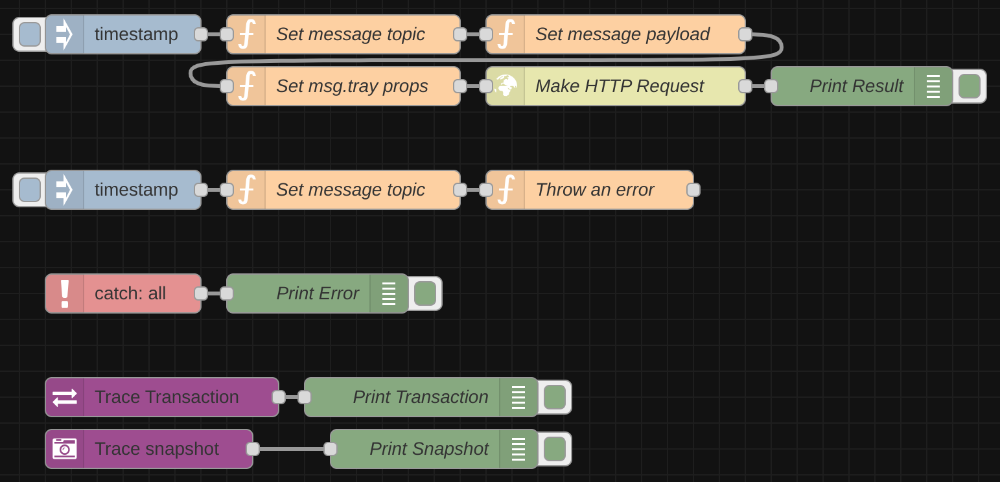

# Node Red message trace

This module adds a debug node to your node-red instance. It will trace messages and their properties as they flow through your app.

By default, it tracks the `msg.payload` and `msg.topic` properties. You can add custom properties as well.

## Node

### Usage

Draw the 'trace' node into your editor. Its output will provide you a detailed message trace as an object and as an array. You can either print these in the console or use any kind of application to visualize them.

### Example

The example output below stems from the [examples/trace_short_custom_props.json](examples/trace_short_flow.json) example. It provides a detailed insight into the message flow, including a `delta` property that shows how the message's properties have changed.

Click to expand

<pre>
<code>[
	{
		sourceNode: { id: 'd5534eb0c652c49b', type: 'inject' },
		destNode: { id: 'e720ad3fda390317', type: 'function', name: 'Set message topic' },
		message: { topic: '', payload: 1692971913389, myProperty: null, myOtherProperty: null },
	},
	{
		sourceNode: { id: 'e720ad3fda390317', type: 'function', name: 'Set message topic' },
		destNode: { id: '061d8e72a9f3b7da', type: 'function', name: 'Set message payload' },
		message: { topic: 'Trace me', payload: 1692971913389, myProperty: null, myOtherProperty: null },
		delta: [
			{
				propertyAddedOrRemoved: false,
				typeHasChanged: false,
				valueHasChanged: true,
				propertyPath: 'topic',
				previousType: 'string',
				currentType: 'string',
				previousValue: '',
				currentValue: 'Trace me',
			},
			{
				propertyAddedOrRemoved: false,
				typeHasChanged: false,
				valueHasChanged: false,
				propertyPath: 'payload',
				previousType: 'number',
				currentType: 'number',
				previousValue: 1692971913389,
				currentValue: 1692971913389,
			},
			{
				propertyAddedOrRemoved: false,
				typeHasChanged: false,
				valueHasChanged: false,
				propertyPath: 'myProperty',
				previousType: 'object',
				currentType: 'object',
				previousValue: null,
				currentValue: null,
			},
			{
				propertyAddedOrRemoved: false,
				typeHasChanged: false,
				valueHasChanged: false,
				propertyPath: 'myOtherProperty',
				previousType: 'object',
				currentType: 'object',
				previousValue: null,
				currentValue: null,
			},
		],
	},
	{
		sourceNode: { id: '061d8e72a9f3b7da', type: 'function', name: 'Set message payload' },
		destNode: { id: 'a63124c968e6e122', type: 'function', name: 'Set msg custom props' },
		message: {
			topic: 'Trace me',
			payload: { message: 'I am being traced' },
			myProperty: null,
			myOtherProperty: null,
		},
		delta: [
			{
				propertyAddedOrRemoved: false,
				typeHasChanged: false,
				valueHasChanged: false,
				propertyPath: 'topic',
				previousType: 'string',
				currentType: 'string',
				previousValue: 'Trace me',
				currentValue: 'Trace me',
			},
			{
				propertyAddedOrRemoved: false,
				typeHasChanged: true,
				valueHasChanged: true,
				propertyPath: 'payload',
				previousType: 'number',
				currentType: 'object',
				previousValue: 1692971913389,
				currentValue: { message: 'I am being traced' },
			},
			{
				propertyAddedOrRemoved: false,
				typeHasChanged: false,
				valueHasChanged: false,
				propertyPath: 'myProperty',
				previousType: 'object',
				currentType: 'object',
				previousValue: null,
				currentValue: null,
			},
			{
				propertyAddedOrRemoved: false,
				typeHasChanged: false,
				valueHasChanged: false,
				propertyPath: 'myOtherProperty',
				previousType: 'object',
				currentType: 'object',
				previousValue: null,
				currentValue: null,
			},
		],
	},
	{
		sourceNode: { id: 'a63124c968e6e122', type: 'function', name: 'Set msg custom props' },
		destNode: { id: '4f8824a5dcde4a04', type: 'debug', name: 'timestamp_out' },
		message: {
			topic: 'Trace me',
			payload: { message: 'I am being traced' },
			myProperty: 'Aye',
			myOtherProperty: 123,
		},
		delta: [
			{
				propertyAddedOrRemoved: false,
				typeHasChanged: false,
				valueHasChanged: false,
				propertyPath: 'topic',
				previousType: 'string',
				currentType: 'string',
				previousValue: 'Trace me',
				currentValue: 'Trace me',
			},
			{
				propertyAddedOrRemoved: false,
				typeHasChanged: false,
				valueHasChanged: false,
				propertyPath: 'payload',
				previousType: 'object',
				currentType: 'object',
				previousValue: { message: 'I am being traced' },
				currentValue: { message: 'I am being traced' },
			},
			{
				propertyAddedOrRemoved: false,
				typeHasChanged: false,
				valueHasChanged: false,
				propertyPath: 'payload.message',
				previousType: 'string',
				currentType: 'string',
				previousValue: 'I am being traced',
				currentValue: 'I am being traced',
			},
			{
				propertyAddedOrRemoved: false,
				typeHasChanged: true,
				valueHasChanged: true,
				propertyPath: 'myProperty',
				previousType: 'object',
				currentType: 'string',
				previousValue: null,
				currentValue: 'Aye',
			},
			{
				propertyAddedOrRemoved: false,
				typeHasChanged: true,
				valueHasChanged: true,
				propertyPath: 'myOtherProperty',
				previousType: 'object',
				currentType: 'number',
				previousValue: null,
				currentValue: 123,
			},
		],
	},
];
</pre>
</code>

### Usage with JSONCrack

The node was designed to make debugging complex flows easier. It works well together with [jsoncrack](https://jsoncrack.com/editor) to visualize what nodes a message passes and how its properties change.

JSONCrack can help you to identify possible problems with the message flow. The following image shows what a part of the `traceMap` output can look like:

### Usage with ChatGPT Prompt

If you aren't a developer, but familiar with ChatGPT, you can use the following prompt to have the famous AI explain possible issues to you:

> You are a Javascript developer responsible for a data pipeline. I will provide you an array of objects and your task will be to explain what properties in the object's 'message' property change and how they might affect downstream nodes. If they a downstream node, add the emjoy '❗' in front of the explanation. If they affect several donwstream nodes, add the emjoy '⚠️' in front of the explanation. Each object has a 'sourceNode'. When providing explanations, assume that the sourceNode's name describes a possible logical applied to the message object.